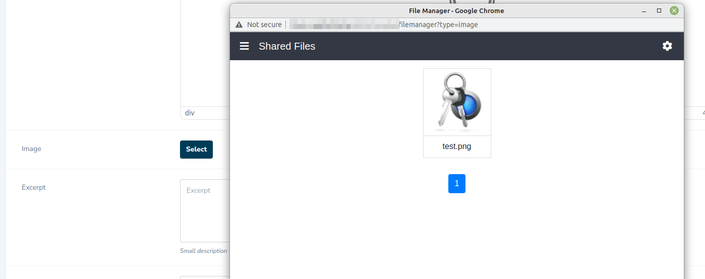
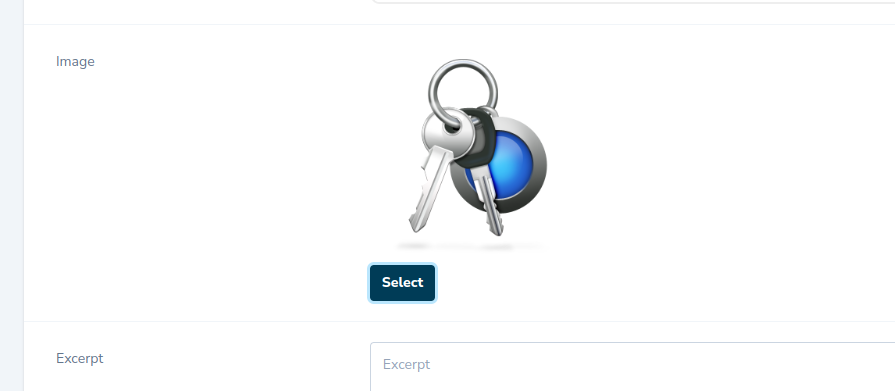
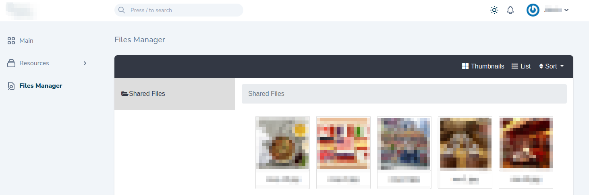
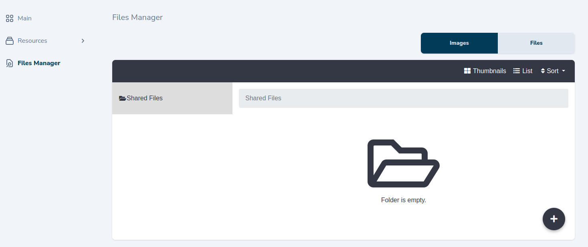

# Laravel nova file selector form laravel filemanager

[](https://github.com/yaroslawww/nova-laravel-filemanager/blob/master/LICENSE.md)
[](https://packagist.org/packages/yaroslawww/nova-laravel-filemanager)
[](https://packagist.org/packages/yaroslawww/nova-laravel-filemanager)
[](https://scrutinizer-ci.com/g/yaroslawww/nova-laravel-filemanager/build-status/master)
[](https://scrutinizer-ci.com/g/yaroslawww/nova-laravel-filemanager/?branch=master)
[](https://scrutinizer-ci.com/g/yaroslawww/nova-laravel-filemanager/?branch=master)

Simple package adds the ability to select an image from [UniSharp/laravel-filemanager](https://github.com/UniSharp/laravel-filemanager)

| Nova | Package |
|------|---------|
| V1-3 | V1      |
| V4   | V2      |

## Usage Field

```php
NLFMImage::make( 'Image', 'image' );
NLFMImage::make( 'Image', 'image' )
    ->filemanagerPath('/custom-link/files');
```

You can specify filemanagerPath in the main laravel-filemanager config file by adding the **filemanager_path** key
```
'filemanager_path' => '/custom-link/files'
```





## Usage Tool

```php
 \ThinkOne\NovaLaravelFilemanager\NLFileManager::make(),
 // or
 \ThinkOne\NovaLaravelFilemanager\NLFileManager::make()
                ->lfmUrl(url(config('lfm.filemanager_path')))
                ->onlyImages()
                ->onlyFiles()
                ->title('Browse files')
                ->icon('document-search')
                ->hideMenu(),
```




## Installation

You can install the package via composer:

```bash
composer require unisharp/laravel-filemanager
# please check guide https://unisharp.github.io/laravel-filemanager/installation

composer require yaroslawww/nova-laravel-filemanager
```

## Routes

```injectablephp
Route::group([
    'prefix'     => config('lfm.filemanager_path'),
    'middleware' => [ 'web', 'auth' ],
], function () {
    \UniSharp\LaravelFilemanager\Lfm::routes();
});
```

## Credits

- [](https://think.studio/)
